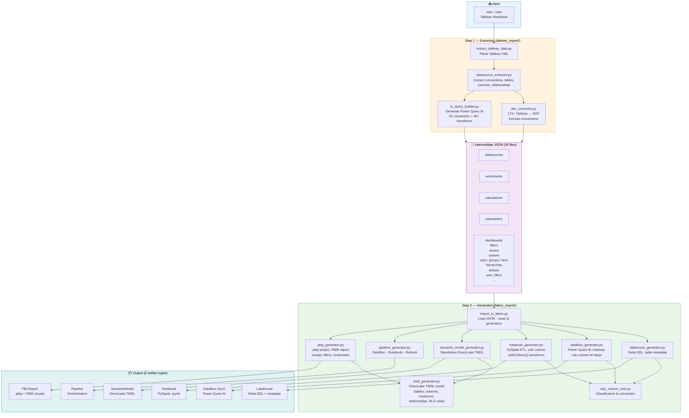

# Tableau to Microsoft Fabric Migration

Automated migration tool for Tableau workbooks (`.twb`, `.twbx`) and Tableau Prep flows (`.tfl`, `.tflx`) to **Microsoft Fabric** artifacts — Lakehouse, Dataflow Gen2, Notebook, Semantic Model, Pipeline, and Power BI Report.

## Features

### Migration Engine
- **Full extraction** of datasources, tables, columns, calculations, relationships, and parameters (16 object types)
- **6 Fabric artifact types**: Lakehouse, Dataflow Gen2, Notebook, Semantic Model (DirectLake), Pipeline, Power BI Report
- **172+ DAX conversions** of Tableau formulas (LOD, table calcs, IF/THEN/END, ISNULL, CONTAINS, security, stats, etc.)
- **60+ visual type mappings**: Tableau marks → Power BI visuals (bar, line, pie, scatter, map, gauge, KPI, waterfall, box plot, funnel, word cloud, combo, matrix, treemap, etc.)
- **25 connector types** in Power Query M (Excel, CSV, SQL Server, PostgreSQL, BigQuery, Oracle, MySQL, Snowflake, Teradata, SAP HANA, SAP BW, Redshift, Databricks, Spark, Azure SQL/Synapse, Google Sheets, SharePoint, JSON, XML, PDF, Salesforce, Web, etc.)
- **40+ Power Query M transformation generators**: rename, filter, aggregate, pivot/unpivot, join, union, sort, conditional columns — chainable via `inject_m_steps()`
- **165 Tableau Prep → Power Query M** operation mappings ([reference doc](docs/TABLEAU_PREP_TO_POWERQUERY_REFERENCE.md))
- **Calculated column materialisation**: automatic classification (measure vs calculated column) with physical materialisation in Lakehouse Delta tables via Dataflow Gen2 (M) and Notebook (PySpark)
- **DirectLake mode**: Semantic Model reads directly from Lakehouse Delta tables — no data import needed
- **Cross-table references**: automatic `RELATED()` (manyToOne) or `LOOKUPVALUE()` (manyToMany)
- **Relationship extraction**: handles both `[Table].[Column]` and bare `[Column]` join clause formats with table inference
- **Row-Level Security (RLS)**: user filters, USERNAME(), ISMEMBEROF() → TMDL RLS roles
- **Parameters**: range, list, and any-domain → What-If parameter tables with SELECTEDVALUE measures
- **Visuals** automatically positioned based on Tableau worksheets and dashboard layouts

### Fabric Artifacts

| Artifact | Description |
|----------|-------------|
| **Lakehouse** | Delta table DDL scripts + metadata (includes materialised calc columns) |
| **Dataflow Gen2** | Power Query M mashup definitions with calc column `Table.AddColumn()` steps |
| **Notebook** | PySpark ETL notebooks (`.ipynb`) with calc column `.withColumn()` transforms |
| **Semantic Model** | Standalone DirectLake TMDL model — entity partitions reference Lakehouse Delta tables |
| **Data Pipeline** | Orchestration: Dataflow → Notebook → Model refresh (dependencies, retry, timeout) |
| **Power BI Report** | `.pbip` project with DirectLake TMDL + PBIR v4.0 visuals (60+ types) |

### Infrastructure
- **Batch migration**: migrate all workbooks in a directory
- **Custom output**: `--output-dir` / `-o` for output location
- **Artifact selection**: `--artifacts lakehouse notebook pipeline` to generate specific types
- **Structured logging**: `--verbose` and `--log-file` flags
- **Artifact validation**: validate generated artifacts (JSON, TMDL, report structure, notebooks)
- **Fabric deployment**: deploy to Microsoft Fabric via PowerShell scripts (idempotent, 429 retry, LRO polling)
- **775 tests**: 21 test files covering all modules, 0 failures

## Quick Start

### Prerequisites

- Python 3.8+
- No external dependencies for core migration (Python standard library only)
- Optional for deployment: PowerShell 5.1+ with `Az` module (`Install-Module Az`)

### One-command migration

```bash
python migrate.py your_workbook.twbx
```

### With specific artifacts

```bash
python migrate.py your_workbook.twb --artifacts lakehouse dataflow notebook semanticmodel pipeline pbi
```

### Batch migration

```bash
python migrate.py "path/to/folder/" -o output/
```

### CLI options

| Flag | Description |
|------|-------------|
| `-o` / `--output-dir DIR` | Custom output directory (default: `artifacts/fabric_projects/`) |
| `--artifacts TYPE [TYPE ...]` | Artifact types to generate (default: all 6) |
| `--verbose` / `-v` | Enable verbose (DEBUG) console logging |
| `--log-file FILE` | Write logs to a file |

Available artifact types: `lakehouse`, `dataflow`, `notebook`, `semanticmodel`, `pipeline`, `pbi`.

### Output

A complete set of Fabric artifacts in `artifacts/fabric_projects/[ReportName]/`:

```
[ReportName]/
├── [ReportName].Lakehouse/
│   ├── lakehouse_definition.json              # Lakehouse item metadata
│   ├── table_metadata.json                    # Table/column inventory
│   └── ddl/
│       ├── Orders.sql                         # CREATE TABLE ... USING DELTA
│       ├── Customers.sql
│       └── Calendar.sql
├── [ReportName].Dataflow/
│   ├── dataflow_definition.json               # Dataflow metadata + Lakehouse destination
│   ├── mashup.pq                              # Combined Power Query M document
│   └── queries/
│       ├── Orders.m                           # Per-table M query
│       └── Customers.m
├── [ReportName].Notebook/
│   ├── etl_pipeline.ipynb                     # PySpark ingestion + transforms
│   └── transformations.ipynb                  # Calc column logic
├── [ReportName].SemanticModel/
│   ├── .platform                              # Fabric Git integration manifest
│   └── definition/
│       ├── model.tmdl                         # DirectLake model config
│       ├── database.tmdl
│       ├── relationships.tmdl
│       ├── expressions.tmdl
│       ├── roles.tmdl                         # RLS role definitions
│       └── tables/
│           ├── Orders.tmdl                    # Columns (sourceColumn) + DAX measures
│           ├── Calendar.tmdl                  # Auto-generated date table
│           └── ...
├── [ReportName].Pipeline/
│   ├── .platform
│   ├── pipeline_definition.json               # Dataflow→Notebook→Refresh stages
│   └── pipeline_metadata.json
└── [ReportName].pbip
    ├── [ReportName].pbip                      # Double-click to open in PBI Desktop
    ├── [ReportName].SemanticModel/
    │   ├── definition.pbism
    │   ├── .platform
    │   └── definition/
    │       ├── model.tmdl
    │       ├── relationships.tmdl
    │       └── tables/
    │           └── *.tmdl
    └── [ReportName].Report/
        ├── definition.pbir
        ├── .platform
        └── definition/
            ├── report.json
            ├── version.json
            ├── RegisteredResources/
            │   └── TableauMigrationTheme.json
            └── pages/
                ├── pages.json
                └── ReportSection/
                    ├── page.json
                    └── visuals/
                        └── [id]/visual.json
```

## Architecture

```
TableauToFabric/
├── migrate.py                                 # CLI entry point (batch, logging, flags)
├── tableau_export/                            # Tableau extraction
│   ├── extract_tableau_data.py                #   TWB/TWBX parser
│   ├── datasource_extractor.py                #   Connection/table/calc extractor
│   ├── dax_converter.py                       #   172+ DAX formula conversions
│   ├── m_query_builder.py                     #   25 connector types + 40+ transform generators
│   └── prep_flow_parser.py                    #   Tableau Prep flow parser (.tfl/.tflx)
├── fabric_import/                             # Fabric artifact generation
│   ├── import_to_fabric.py                    #   Orchestrator (routes to 6 generators)
│   ├── lakehouse_generator.py                 #   Lakehouse DDL & metadata
│   ├── dataflow_generator.py                  #   Dataflow Gen2 mashup + calc column steps
│   ├── notebook_generator.py                  #   PySpark notebook + calc column transforms
│   ├── semantic_model_generator.py            #   Standalone SemanticModel (DirectLake)
│   ├── pipeline_generator.py                  #   Data Pipeline orchestration
│   ├── pbip_generator.py                      #   .pbip project + visuals
│   ├── tmdl_generator.py                      #   DirectLake TMDL model
│   ├── visual_generator.py                    #   60+ visual types, PBIR-native configs
│   ├── calc_column_utils.py                   #   Calc column classification & conversion
│   ├── validator.py                           #   Artifact validation (JSON, TMDL, notebooks)
│   ├── auth.py                                #   Azure AD auth (Service Principal / MI)
│   ├── client.py                              #   Fabric REST API client (retry + fallback)
│   ├── deployer.py                            #   Fabric deployment orchestrator
│   ├── utils.py                               #   DeploymentReport, ArtifactCache
│   └── config/                                #   Configuration
│       ├── settings.py                        #     Env-var based settings
│       └── environments.py                    #     Dev/staging/production configs
├── conversion/                                # Legacy per-object converters
├── tests/                                     # 775 tests (21 test files)
├── docs/                                      # Documentation (7 guides + FAQ)
├── examples/                                  # Sample Tableau files (see Examples section)
│   └── tableau_samples/
│       ├── simple_report.twb                  #     Minimal TWB (1 datasource, 1 chart)
│       ├── medium_report.twb                  #     Mid-complexity TWB (joins, params, 3 charts)
│       ├── complex_report.twb                 #     Full TWB (3 datasources, LOD, RLS, story)
│       ├── simple_prep_flow.tfl               #     Minimal TFL (CSV → clean → output)
│       ├── medium_prep_flow.tfl               #     Mid-complexity TFL (2 inputs, join, aggregate)
│       ├── complex_prep_flow.tfl              #     Full TFL (5 inputs, union, 3 joins, pivot)
│       └── real_world/                        #     Real Tableau files from public repos
│           ├── SOURCES.md                     #       Attribution & licenses
│           ├── sample-superstore.twb          #       Official Superstore sample
│           ├── datasource_test.twb            #       Multi-datasource test
│           ├── multiple_connections.twb       #       Multiple connections test
│           ├── TABLEAU_10_TWB.twb             #       Tableau v10 format test
│           └── tableau_prep_book.tfl          #       Real Prep flow (10 nodes, union+join)
├── scripts/                                   # Fabric deployment (PowerShell)
│   ├── TableauToFabric.psm1                   #   Shared module (auth, API, TMDL, PBIR)
│   ├── New-MigrationWorkspace.ps1             #   Create/reuse workspace + capacity
│   ├── Deploy-TableauMigration.ps1            #   Deploy all artifacts (dependency order)
│   └── Validate-Deployment.ps1               #   Post-deploy validation
├── .github/                                   # CI/CD
│   └── workflows/
│       └── ci-tests.yml                       #   GitHub Actions (5 Python versions + lint)
├── artifacts/                                 # Generated output
│   └── fabric_projects/                       #   Fabric artifacts
└── requirements.txt
```

## Pipeline

```
.twbx/.twb → extract_tableau_data.py → 16 JSON files → import_to_fabric.py → 6 Fabric artifact types
```

### Detailed Diagram



## DAX Conversions (172+ functions)

> **Full reference:** [docs/TABLEAU_TO_DAX_REFERENCE.md](docs/TABLEAU_TO_DAX_REFERENCE.md)

| Category | Tableau | DAX |
|----------|---------|-----|
| Logic | `IF cond THEN val ELSE val2 END` | `IF(cond, val, val2)` |
| Logic | `IF ... ELSEIF ... END` | `IF(..., ..., IF(...))` |
| Null | `ISNULL([col])` | `ISBLANK([col])` |
| Text | `CONTAINS([col], "text")` | `CONTAINSSTRING([col], "text")` |
| Agg | `COUNTD([col])` | `DISTINCTCOUNT([col])` |
| Agg | `AVG([col])` | `AVERAGE([col])` |
| Text | `ASCII([col])` | `UNICODE([col])` |
| Syntax | `==` | `=` |
| Syntax | `or` / `and` | `\|\|` / `&&` |
| Syntax | `+` (strings) | `&` |
| LOD | `{FIXED [dim] : AGG}` | `CALCULATE(AGG, ALLEXCEPT)` |
| LOD | `{EXCLUDE [dim] : AGG}` | `CALCULATE(AGG, REMOVEFILTERS)` |
| Table Calc | `RUNNING_SUM / RANK` | `CALCULATE / RANKX` |
| Iterator | `SUM(IF(...))` | `SUMX('table', IF(...))` |
| Cross-table | `[col]` other table (manyToOne) | `RELATED('Table'[col])` |
| Cross-table | `[col]` other table (manyToMany) | `LOOKUPVALUE(...)` |
| Security | `USERNAME()` | `USERPRINCIPALNAME()` |
| Stats | `MEDIAN / STDEV / PERCENTILE` | `MEDIAN / STDEV.S / PERCENTILE.INC` |

## Calculated Column Materialisation

> **Full guide:** [docs/CALCULATED_COLUMNS_GUIDE.md](docs/CALCULATED_COLUMNS_GUIDE.md)

In **DirectLake** mode, calculated columns cannot be DAX expressions — they must be physical columns in the Lakehouse. The tool automatically materialises them:

```
Tableau calculated column (dimension role):
  IF [Revenue] > 10000 THEN "High" ELSE "Low" END

Lakehouse DDL:      Revenue_Tier STRING
Dataflow Gen2 (M):  Table.AddColumn(Source, "Revenue_Tier", each if [Revenue] > 10000 then "High" else "Low")
Notebook (PySpark):  df.withColumn("Revenue_Tier", F.when(F.col("Revenue") > 10000, "High").otherwise("Low"))
TMDL:               sourceColumn: Revenue_Tier   (not expression = DAX(...))
```

## Complex Transformation Examples

### LOD Expressions → CALCULATE

| Tableau LOD | Generated DAX |
|-------------|---------------|
| `{FIXED [customer_id] : SUM([quantity] * [unit_price])}` | `CALCULATE(SUM('Orders'[quantity] * 'Orders'[unit_price]), ALLEXCEPT('Orders', 'Orders'[customer_id]))` |
| `{FIXED [region], [channel] : SUM(...)}` | `CALCULATE(SUM(...), ALLEXCEPT('Orders', 'Orders'[region], 'Orders'[channel]))` |
| `{EXCLUDE [channel] : SUM(...)}` | `CALCULATE(SUM(...), REMOVEFILTERS('Orders'[channel]))` |

### SUM(IF) → SUMX Iterator Conversion

```
Tableau:  SUM(IF [order_status] != "Cancelled" THEN [quantity] * [unit_price] * (1 - [discount]) ELSE 0 END)
DAX:      SUMX('Orders', IF('Orders'[order_status] != "Cancelled", 'Orders'[quantity] * 'Orders'[unit_price] * (1 - 'Orders'[discount]), 0))
```

### Nested IF/ELSEIF → Nested IF()

```
Tableau:  IF [Revenue] > 10000 THEN "Platinum"
          ELSEIF [Revenue] > 5000 THEN "Gold"
          ELSEIF [Revenue] > 1000 THEN "Silver"
          ELSE "Bronze" END

DAX:      IF([Revenue] > 10000, "Platinum", IF([Revenue] > 5000, "Gold", IF([Revenue] > 1000, "Silver", "Bronze")))
```

### Cross-Table References (RELATED)

```
Tableau calc column:    [segment]      → where segment lives in Customers table
DAX calculated column:  RELATED('Customers'[segment])     (when on Orders table, manyToOne relationship)
```

### Row-Level Security (RLS) Migration

| Tableau Security | Generated TMDL RLS |
|------------------|-------------------|
| `<user-filter>` with user→value mappings | Role with `USERPRINCIPALNAME() = "user@co.com" && [Col] IN {"val1", "val2"}` |
| `[Email] = USERNAME()` | Role with `[Email] = USERPRINCIPALNAME()` |
| `ISMEMBEROF("Managers")` | Separate RLS role `Managers` (assign Azure AD group) |

### Parameters → What-If Tables

| Tableau Parameter | Generated Semantic Model |
|-------------------|------------------------|
| Integer range (min=2020, max=2030) | `GENERATESERIES(2020, 2030, 1)` table + `SELECTEDVALUE` measure |
| String list ("All", "Europe", ...) | `DATATABLE("Value", STRING, {{"All"}, {"Europe"}, ...})` table + `SELECTEDVALUE` measure |
| Real range (min=0, max=0.5, step=0.01) | `GENERATESERIES(0, 0.5, 0.01)` table + `SELECTEDVALUE` measure |

## Validation

Validate generated artifacts before deploying to Fabric:

```python
from fabric_import.validator import ArtifactValidator

# Validate a single project
result = ArtifactValidator.validate_project("artifacts/fabric_projects/MyReport")
print(result)  # {"valid": True, "files_checked": N, "errors": []}

# Validate all projects in a directory
results = ArtifactValidator.validate_directory("artifacts/fabric_projects/")
```

The validator checks:
- Lakehouse DDL files exist and are valid SQL
- Dataflow mashup and query files exist
- Notebook `.ipynb` files are valid JSON with correct metadata
- SemanticModel TMDL files are well-formed (model, tables, relationships)
- Report `.pbir`, page and visual JSON files

## Fabric Deployment

Deploy generated artifacts to a Microsoft Fabric workspace using the PowerShell deployment scripts in `scripts/`.

### Prerequisites

1. **PowerShell 5.1+** (Windows) or **PowerShell 7+** (cross-platform)
2. **Az PowerShell module** — install once:
   ```powershell
   Install-Module Az -Scope CurrentUser -Force
   ```
3. **Azure login** — authenticate before deploying:
   ```powershell
   Connect-AzAccount
   ```
4. A **Fabric capacity** (F2+, P1+, or trial) and permissions to create workspaces/items

### Deployment Scripts

| Script | Purpose |
|--------|---------|
| `scripts/TableauToFabric.psm1` | Shared module — auth, Fabric API (429 retry, LRO), OneLake, TMDL, PBIR helpers |
| `scripts/New-MigrationWorkspace.ps1` | Create (or reuse) a Fabric workspace + assign capacity |
| `scripts/Deploy-TableauMigration.ps1` | Deploy all artifacts in dependency order |
| `scripts/Validate-Deployment.ps1` | Verify all expected items exist in the workspace |

### End-to-End Example

```powershell
# Step 1 — Generate artifacts from a Tableau workbook
python migrate.py your_workbook.twbx -o output/

# Step 2 — Create a Fabric workspace (idempotent)
$ws = .\scripts\New-MigrationWorkspace.ps1 `
    -WorkspaceName "Tableau Migration - Superstore" `
    -CapacityId   "xxxxxxxx-xxxx-xxxx-xxxx-xxxxxxxxxxxx"

# Step 3 — Deploy all artifacts
.\scripts\Deploy-TableauMigration.ps1 `
    -WorkspaceId $ws.WorkspaceId `
    -ProjectDir  "output/Superstore"

# Step 4 — Validate
.\scripts\Validate-Deployment.ps1 `
    -WorkspaceId $ws.WorkspaceId `
    -ProjectDir  "output/Superstore"
```

### Deployment Order

The deploy script auto-discovers artifact directories by suffix and deploys in dependency order:

```
1. Lakehouse  (empty)        → waits for SQL analytics endpoint
2. Notebook   (+lakehouse binding injected)
3. Dataflow   (Gen2)
4. Semantic Model  (TMDL — SQL endpoint + lakehouse name tokens replaced)
5. Report     (PBIR — byPath → byConnection rewrite with Semantic Model ID)
6. Pipeline   (references above items)
```

### Deploy Options

```powershell
# Dry run — show what would be deployed without API calls
.\scripts\Deploy-TableauMigration.ps1 -WorkspaceId $wsId -ProjectDir ./output/X -DryRun

# Deploy and run notebooks automatically
.\scripts\Deploy-TableauMigration.ps1 -WorkspaceId $wsId -ProjectDir ./output/X -RunNotebooks

# Deploy and run the full pipeline
.\scripts\Deploy-TableauMigration.ps1 -WorkspaceId $wsId -ProjectDir ./output/X -RunPipeline

# Skip specific artifact types
.\scripts\Deploy-TableauMigration.ps1 -WorkspaceId $wsId -ProjectDir ./output/X -SkipDataflow -SkipPipeline
```

### Key Features

- **Idempotent** — re-running the script reuses existing items (no duplicates)
- **429 retry** — automatic backoff when hitting Fabric rate limits
- **LRO polling** — handles long-running operations (202 Accepted)
- **TMDL BOM stripping** — strips UTF-8 BOM before base64 encoding
- **PBIR byConnection** — rewrites `definition.pbir` from local `byPath` to live `byConnection` with the deployed Semantic Model ID
- **Notebook lakehouse binding** — injects workspace ID + lakehouse ID into notebook metadata
- **SQL endpoint discovery** — polls until the Lakehouse SQL endpoint is provisioned
- **Timing summary** — displays duration per step at the end

### Python Deployment API (programmatic)

The `fabric_import/` package also provides a Python API for programmatic deployment:

```python
from fabric_import.deployer import FabricDeployer
deployer = FabricDeployer()
deployer.deploy_lakehouse(workspace_id, 'MyLakehouse', config)
deployer.deploy_semantic_model(workspace_id, 'MyModel', config)
```

Requires: `pip install azure-identity requests`

## Testing

```bash
# Run all 775 tests
python -m pytest tests/ -v

# Run specific test file
python -m pytest tests/test_lakehouse_generator.py -v
python -m pytest tests/test_dataflow_generator.py -v
python -m pytest tests/test_calc_column_utils.py -v
```

| Test File | Tests | Coverage |
|-----------|-------|---------|
| `test_lakehouse_generator.py` | Lakehouse DDL, table metadata, Delta types, calc columns |
| `test_dataflow_generator.py` | Dataflow M queries, mashup, connectors, calc column steps |
| `test_notebook_generator.py` | PySpark notebooks, ETL cells, calc column transforms |
| `test_semantic_model_generator.py` | TMDL model, tables, DirectLake partitions, sourceColumn |
| `test_pipeline_generator.py` | Pipeline stages, dependencies, retry policies |
| `test_import_to_fabric.py` | Orchestrator, artifact routing |
| `test_migrate.py` | CLI, batch, flags |
| `test_validator.py` | Artifact validation |
| `test_deployer.py` | Deployment orchestration |
| `test_auth.py` | Azure AD authentication |
| `test_client.py` | HTTP client, retry logic |
| `test_config.py` | Settings, environments |
| `test_utils.py` | Deployment report, cache |
| `test_calc_column_utils.py` | Calc column classification, formula conversion (M + PySpark) |

## CI/CD Workflow

A GitHub Actions workflow runs automatically on every push to `main`/`develop` and on pull requests.

### Pipeline Overview

```
┌──────────────────────────────────────────────────────────────────────────┐
│                    GitHub Actions — CI Tests                             │
│                                                                          │
│  Trigger: push (main, develop) | pull_request (main)                    │
│                                                                          │
│  ┌────────────────────────────────────────────────────────────────────┐  │
│  │  Job 1: unit-tests (matrix: Python 3.8 / 3.9 / 3.10 / 3.11 / 3.12) │  │
│  │                                                                    │  │
│  │  1. Checkout repository                                            │  │
│  │  2. Setup Python ${{ matrix.python-version }}                      │  │
│  │  3. Run 775 unit tests (pytest)                                │  │
│  │  4. Generate JUnit XML test report                             │  │
│  │  5. Upload test results artifact (30-day retention)                │  │
│  │  6. Publish test report (dorny/test-reporter, Python 3.11 only)   │  │
│  └────────────────────────────────────────────────────────────────────┘  │
│                                                                          │
│  ┌────────────────────────────────────────────────────────────────────┐  │
│  │  Job 2: lint — Code Quality Checks                                 │  │
│  │                                                                    │  │
│  │  1. Checkout repository                                            │  │
│  │  2. py_compile all .py files (syntax check)                        │  │
│  │  3. Import-check all 16 core modules (fabric_import + tableau_export)│  │
│  └────────────────────────────────────────────────────────────────────┘  │
│                                                                          │
│  Artifacts: test-results-py{version}/*.xml (JUnit XML, 30 days)         │
└──────────────────────────────────────────────────────────────────────────┘
```

### Workflow File

[`.github/workflows/ci-tests.yml`](.github/workflows/ci-tests.yml)

### Running Locally

```bash
# Same checks the CI runs:

# 1. Unit tests (775 tests)
python -m pytest tests/ -v

# 2. Syntax check (all .py files)
python -m py_compile migrate.py
python -m py_compile fabric_import/import_to_fabric.py
# ... (CI checks all .py files automatically)

# 3. Import check (all 16 core modules)
python -c "import fabric_import.import_to_fabric"
python -c "import tableau_export.extract_tableau_data"
```

### Test Results

CI produces JUnit XML reports uploaded as GitHub Actions artifacts. On Python 3.11,
the `dorny/test-reporter` action publishes a visual test report directly in the PR
checks tab, showing pass/fail per test with timing data.

| Check | Description | Fail Condition |
|-------|-------------|----------------|
| **unit-tests** | 775 tests × 5 Python versions | Any test failure |
| **lint** | `py_compile` + module import | Syntax error or broken import |

## Documentation

- [Fabric project guide](docs/FABRIC_PROJECT_GUIDE.md)
- [Tableau ↔ Fabric mapping reference](docs/MAPPING_REFERENCE.md)
- [Calculated columns materialisation guide](docs/CALCULATED_COLUMNS_GUIDE.md)
- [172 Tableau → DAX function reference](docs/TABLEAU_TO_DAX_REFERENCE.md)
- [108 Tableau → Power Query M property reference](docs/TABLEAU_TO_POWERQUERY_REFERENCE.md)
- [165 Tableau Prep → Power Query M transformation reference](docs/TABLEAU_PREP_TO_POWERQUERY_REFERENCE.md)
- [FAQ](docs/FAQ.md)

## Example Files

The `examples/tableau_samples/` directory contains sample files at three complexity levels for both workbooks and prep flows, plus real-world files from public repositories.

### Synthetic Examples

#### Workbooks (.twb)

| File | Complexity | Features |
|------|-----------|----------|
| `simple_report.twb` | Low | 1 SQL Server datasource, 1 table (6 columns), 1 Bar chart, 1 dashboard |
| `medium_report.twb` | Medium | PostgreSQL, 2 joined tables, 2 calculated fields, parameter, hierarchy, aliases, 3 worksheets, dashboard with filters |
| `complex_report.twb` | High | 3 datasources (SQL Server 4-table join, Excel, Custom SQL), 10+ calcs (LOD, SUM IF, CASE WHEN, DATEDIFF, window), 2 parameters, hierarchies, groups, sets, bins, RLS, 7 worksheets, 2 dashboards, actions, story |

#### Prep Flows (.tfl)

| File | Complexity | Features |
|------|-----------|----------|
| `simple_prep_flow.tfl` | Low | 1 CSV input → clean (rename, remove, type, trim) → Hyper output |
| `medium_prep_flow.tfl` | Medium | SQL Server + Excel inputs → clean → join → aggregate + detail outputs |
| `complex_prep_flow.tfl` | High | 5 inputs, union, 3 joins, pivot, aggregate, conditional columns, calculated columns, 3 outputs |

### Real-World Files

Downloaded from public GitHub repositories (see `real_world/SOURCES.md` for licenses and attribution):

| File | Source | Description |
|------|--------|-------------|
| `sample-superstore.twb` | tableau/document-api-python (MIT) | Official Superstore sample — 24 fields, SQL Server |
| `datasource_test.twb` | tableau/document-api-python (MIT) | Multi-datasource test workbook |
| `multiple_connections.twb` | tableau/document-api-python (MIT) | Multiple data connections test |
| `TABLEAU_10_TWB.twb` | tableau/document-api-python (MIT) | Tableau v10 format compatibility |
| `tableau_prep_book.tfl` | aloth/tableau-book-resources (CC-BY-4.0) | 10-node flow: CSV/Excel inputs, union, join, Hyper output |

### Running Examples

```bash
# Migrate a simple workbook
python migrate.py examples/tableau_samples/simple_report.twb

# Migrate a complex workbook with specific artifacts
python migrate.py examples/tableau_samples/complex_report.twb --artifacts lakehouse semanticmodel pbi

# Migrate a prep flow
python migrate.py examples/tableau_samples/medium_prep_flow.tfl --prep

# Migrate a real-world workbook
python migrate.py examples/tableau_samples/real_world/sample-superstore.twb -o output/superstore

# Migrate a real prep flow
python migrate.py examples/tableau_samples/real_world/tableau_prep_book.tfl --prep -o output/prep_book
```

## Changelog

### Latest

#### Bug Fixes
- **DAX LOD conversion** — Fixed destructive global `}` → `)` replacement that corrupted non-LOD DAX expressions. The converter now only replaces braces belonging to LOD-without-dimension patterns.
- **DAX `ZN()` / `IFNULL()` conversion** — Fixed broken regex that failed on nested parentheses (e.g., `ZN(IF(x, a, b))`). Both functions now use balanced-paren depth tracking.
- **Relationship format mismatch** — `_build_relationships()` in the TMDL generator now supports both `{from_table, from_column}` (extractor format) and `{left: {table, column}}` (legacy format).
- **DirectLake + Calendar conflict** — Auto-generated Calendar table is now skipped in DirectLake mode to avoid mixing import and DirectLake storage modes.
- **Column extraction** — Added `<metadata-records>` parsing (Phase 3) and fallback extraction (Phase 4) to `datasource_extractor.py`, increasing column coverage from 6 to 24 for the Superstore sample.
- **Reference line color** — Fixed double single-quote bug in `pbip_generator.py` reference line generation.
- **Validator double-check** — Removed duplicate SemanticModel validation that was doubling `files_checked` counts and error reports.

#### Code Quality
- **Error handling** — Replaced bare `except Exception: pass` blocks with logged warnings (`logger.warning`/`logger.debug`) across `import_to_fabric.py` and `migrate.py` (8 occurrences).
- **Debug code removed** — Replaced `traceback.print_exc()` with `logging.exception()` in `pbip_generator.py`.
- **`sys.path` hygiene** — Consolidated 3 duplicate `sys.path.insert()` calls in `migrate.py` into a single guarded insertion at module level. Added guard in `dataflow_generator.py`.
- **Import cleanup** — Removed redundant local `import re` in `import_to_fabric.py._sanitize_name()` and `pipeline_generator.py._sanitize()`.
- **Deprecated API** — Replaced `datetime.utcnow()` with `datetime.now(timezone.utc)` in `utils.py`.
- **DAX converter helper** — Added `_extract_balanced_call()` utility for reusable balanced-paren function matching (used by `ZN` and `IFNULL` converters).

#### Deployment
- **Notebook upload** — Added `ConvertTo-FabricPyNotebook` for Fabric `.py` format with required prologue.
- **Report creation** — Reports now include definition parts at creation time (fixes `MissingDefinition` error).
- **Pipeline item references** — `Get-PipelineDefinitionParts` rewrites activity references with actual deployed item IDs (notebook, dataflow, semantic model).
- **Dataflow item type** — Changed from `DataflowGen2` to `Dataflow` (correct Fabric API name).

## Known Limitations

- `MAKEPOINT()` (Tableau spatial) has no DAX equivalent → ignored
- `PREVIOUS_VALUE()` / `LOOKUP()` require manual conversion
- Data source paths must be reconfigured in Dataflow Gen2 after migration
- Some table calculations (`INDEX()`, `SIZE()`) are approximated
- DirectLake mode requires all calculated columns to be physically materialised
- Fabric deployment requires PowerShell with the `Az` module and `Connect-AzAccount`
